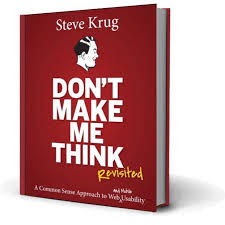

# Não me faça pensar

<<<<<<< HEAD
Nesse livro você encontrará todas as narrativas do autor focadas em usabilidade. É necessário entender como a tecnologia afeta nossos padrões de navegação diários. A grande maioria de nós não reflete sobre o quão difícil é criar um site em que todos os usuários possam usá-lo sem problemas. 

A verdade é que as pessoas não usam a internet "do jeito que imaginamos".Como se vê, esta é a vida de muitos programadores. Afinal, a atenção aos detalhes é fundamental, pois a segurança dos dados é muito importante para que possa conseguir uma reputação e confiança entre os usuários.

É por isso que o autor Steve Krug escreveu Don't Make Me Think, um livro dedicado à usabilidade, e o mais importante, você precisa ter certeza de que a página é exatamente o que o usuário precisa,ele tinha em mente fazer com que nós, desenvolvedores, pudéssemos nos sentir no lugar dos usuários.

Esta visão permite-nos tornar o website mais objetivo e, assim, mais fácil de interpretar. Para quem não conhece os tópicos de UX, não tem problema, o autor usa uma linguagem simples, até divertida, para entender.
=======
Nesse livro você encontrará todas as narrativas do autor focadas em usabilidade. É necessário entender como a tecnologia afeta nossos padrões de navegação diários. A grande maioria de nós não reflete sobre o quão difícil é criar um site em que todos os usuários possam usá-lo sem problemas. A verdade é que as pessoas não usam a internet "do jeito que imaginamos".Como se vê, esta é a vida de muitos programadores. Afinal, a atenção aos detalhes é fundamental, pois a segurança dos dados é muito importante para que possa conseguir uma reputação e confiança entre os usuários.É por isso que o autor Steve Krug escreveu Don't Make Me Think, um livro dedicado à usabilidade, e o mais importante, você precisa ter certeza de que a página é exatamente o que o usuário precisa,ele tinha em mente fazer com que nós, desenvolvedores, pudéssemos nos sentir no lugar dos usuários. Esta visão permite-nos tornar o website mais objetivo e, assim, mais fácil de interpretar. Para quem não conhece os tópicos de UX, não tem problema, o autor usa uma linguagem simples, até divertida, para entender.
>>>>>>> ebd395da80527c50e06f8f8dff221dc2033ecc54
