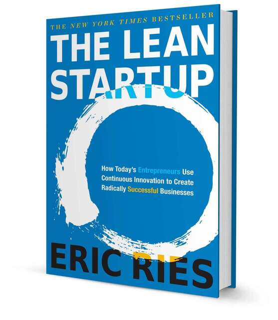

# Startup Enxuta

O que diz se uma startup vai sobreviver ao mercado não está relacionado ao seu produto, mas a dedicação e gestão diária que será depositada na empresa. A startup enxuta é um termo usado que define instituições que lançam o mais rápido possível o seu MVP, prestando sempre atenção na quantidade de aprendizagem validada que está sendo e será obtida. 

Deve-se estar sempre de olho na produtividade, a preocupação não pode ser focada na quantidade de coisas que a equipe está desenvolvendo mas sim em criar um modelo sustentável que consiga gerar lucro e manter seus clientes, portanto precisa-se que novos clientes surjam das ações de clientes passados, a empresa também usará indicadores incomuns para melhorar o crescimento, metas, OKR e tarefas são sempre bem vindas. 

Importante sempre se colocar no lugar do consumidor e se perguntar, os clientes reconhecem que tem um problema e precisam de solução?, se esse problema for válido, o cliente estará disposto a pagar por ele?, a partir disso você já pode dar início e colocar sua ideia em prática utilizando nossa ferramenta.
